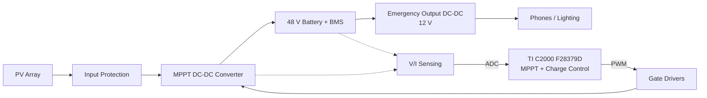

# Solar-Powered Off-Grid Charging System for a 48 V Light EV

**ELEC/COEN 490 Capstone · Team 29 · Concordia University · 2026–2027**
Supervisor: Prof. Pragasen Pillay

A photovoltaic charging system that charges the 48 V battery of a light electric three-wheeler with **no grid connection**, and lets the stored energy power **low-voltage emergency loads** such as phones and lighting.

This repository contains the firmware for the TI C2000 F28379D, the MATLAB/Simulink simulation models, and the PCB design files.

> **Status:** Phase 1 (Selection and Planning) complete. Design is in progress. All specifications below are **preliminary** and will be finalized in Phase 2.

---

## Table of Contents

- [System Overview](#system-overview)
- [Preliminary Specifications](#preliminary-specifications)
- [Repository Structure](#repository-structure)
- [Getting Started](#getting-started)
- [Firmware Overview](#firmware-overview)
- [Contribution Workflow](#contribution-workflow)
- [Project Timeline](#project-timeline)
- [Team](#team)
- [References](#references)

---

## System Overview



| Subsystem | Description |
| --- | --- |
| **Power stage** | DC-DC converter between the PV array and the battery. Topology (buck, boost or buck-boost) is selected from the measured PV curves and the battery voltage window. Buck is the leading candidate from the Phase 1 alternatives analysis. |
| **Control** | MPPT (Perturb & Observe or Incremental Conductance as starting points) and charging control on the F28379D. Battery limits always take priority over maximum power extraction. |
| **Sensing** | PV voltage, PV current, battery voltage, battery charging current, temperature. |
| **Protection** | Overcurrent, overvoltage, overtemperature, reverse current, reverse polarity, excessive discharge. Critical faults handled in hardware; recoverable faults in firmware. |
| **Emergency output** | Separate protected DC-DC stage from the battery to a regulated low-voltage output with overload and short-circuit protection. |

---

## Preliminary Specifications

| Parameter | Target | Notes |
| --- | --- | --- |
| Nominal battery voltage | 48 V | Fixed by project brief |
| Battery operating range / charge setpoint / max current | TBD | Depends on battery chemistry and BMS |
| Continuous charging power | 400 W | Based on TI TIDA-010042 |
| Switching frequency | TBD | Starting value |
| DC-DC conversion efficiency | ≥ 95 % | η = P_battery / P_PV,input |
| MPPT tracking efficiency | ≥ 98 % | η = P_PV,operating / P_PV,maximum |
| Battery voltage regulation error | ≤ 2 % | |
| Battery current regulation error | ≤ 5 % | |
| Emergency output | TBD | |
| Reference PV module | Canadian Solar CS6.1-54TM-450H | 450 W, Vmp 33.0 V, Voc 38.9 V, Imp 13.66 A (STC) |

---

## Repository Structure

```
.
├── firmware/               # Code Composer Studio project for the F28379D
│   ├── src/                #   Application code (MPPT, control loops, state machine)
│   ├── drivers/            #   ADC, ePWM, GPIO, fault handling
│   └── include/
├── simulation/
│   ├── matlab/             # MATLAB/Simulink + Simscape Electrical models
├── hardware/
│   ├── schematics/         # Power stage, sensing, protection, emergency output
│   ├── pcb/                # Layout and fabrication outputs
│   └── bom/                # Bill of materials (Concordia BOM template)
├── test/
│   ├── procedures/         # Test procedures mapped to the specifications
│   └── results/            # Measured data, scope captures, efficiency results
└── docs/                   # Phase reports, design notes, datasheets references
```

---

## Getting Started

### Requirements

| Tool | Use |
| --- | --- |
| [Code Composer Studio](https://www.ti.com/tool/CCSTUDIO) + C2000Ware | Firmware development and debugging |
| MATLAB/Simulink with Simscape Electrical and Embedded Coder | System simulation and controller design |
| TI LAUNCHXL-F28379D | Target hardware |

### Clone

```bash
git clone <repository-url>
cd <repository-name>
```

### Build and flash the firmware

1. Open Code Composer Studio and select **File → Import → CCS Projects**.
2. Point it at the `firmware/` folder.
3. Connect the F28379D LaunchPad over USB.
4. Build the project and start a debug session to flash the board.

### Run the simulations

1. Open MATLAB and add `simulation/matlab/` to the path.
2. Open the top-level Simulink model and run it.

### ⚠️ Safety

The power stage works with high DC currents and PV voltages that cannot be switched off while the panel is in sunlight. Always:
- test new firmware with the PV emulator and a current-limited supply before connecting real modules or the battery;
- use differential probes on the switching node;
- follow the Concordia lab safety rules (the whole team must pass the Moodle safety quiz).

---

## Team

| Member | Program | Main areas |
| --- | --- | --- |
| Nadir Chetouani | Electrical Eng. | DC-DC converter design, PV/battery characterization, simulation |
| Marijan Miskovski | Electrical Eng. | Converter design, control, sensing and protection |
| Mohamed Ali Al-Difai | Electrical Eng. | Simulation, sensing and protection, data analysis, emergency output |
| Ivan Arapović | Electrical Eng. | Testing lead, converter design, MPPT, emergency output |
| Gabriel Lauture | Computer Eng. | F28379D firmware, ADC/PWM, MPPT and control implementation |
| Kenny Boum-Biha | Computer Eng. | Firmware, MPPT and control, Simulink, emergency output |

---

## References

- Project brief: *Solar-Powered Off-Grid Charging System for a 48 V Light EV for Emergency Power*, ELEC 490, Prof. P. Pillay, 2026.
- Texas Instruments, *400-W GaN-Based MPPT Charge Controller and Power Optimizer Reference Design* (TIDA-010042).
- M. Bhardwaj, *Implementing Photovoltaic Battery Charging System using C2000 Microcontrollers on Solar Explorer Kit*, Texas Instruments.
- Microchip, *Practical Guide to Implementing Solar Panel MPPT Algorithms* (AN1521).
- Microchip, *Solar MPPT Battery Charger for the Rural Electrification System* (AN2321).
- M. R. Haque et al., "Performance Evaluation of 1kW Asynchronous and Synchronous Buck Converter-based Solar-powered Battery Charging System for Electric Vehicles," IEEE TENSYMP, 2020.

Full reference list: see the Phase 1 report in `docs/`.
